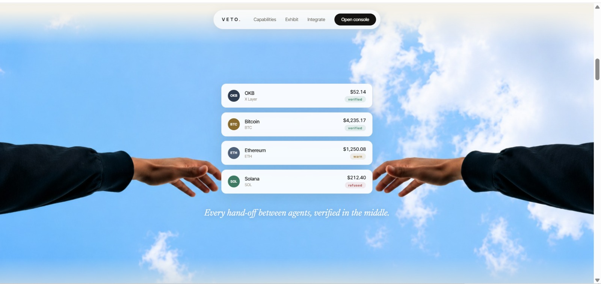
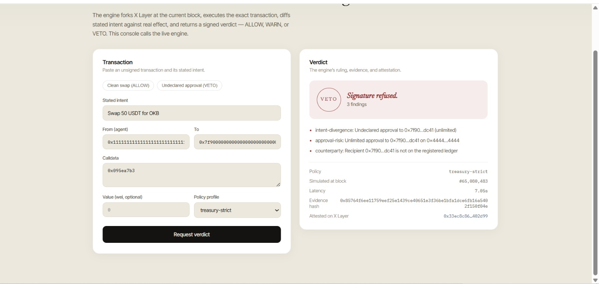
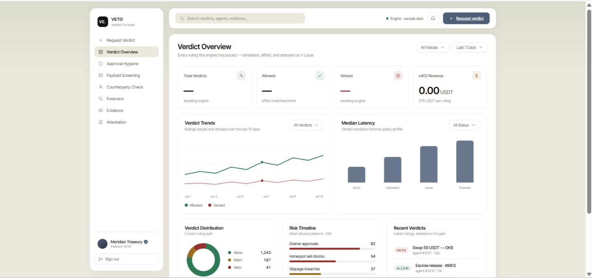
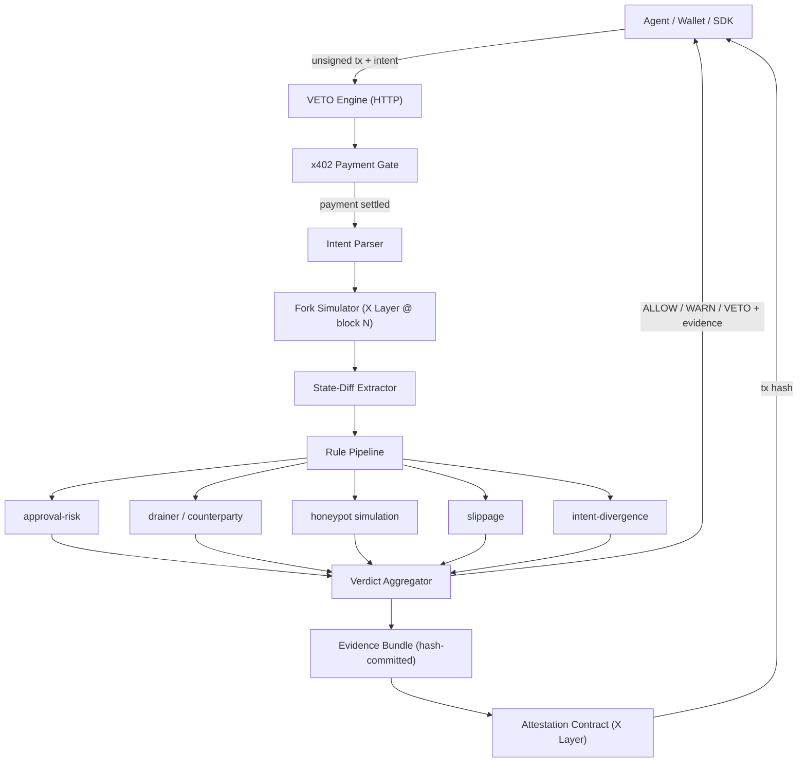

# VETO
### The Last Word Before the Chain -- Pre-Signature Verification for Autonomous Agents


-2E7A57?style=flat-square&labelColor=141311)


[](https://github.com/0xkinno/veto/actions/workflows/ci.yml)
[](https://github.com/0xkinno/veto/actions/workflows/codeql.yml)

> **Every autonomous transaction is signed in the dark. VETO turns the light on -- before the signature, not after the loss.**

VETO is a pre-signature verification layer for autonomous agents. An agent sends VETO an unsigned transaction plus its stated intent. VETO forks X Layer at the current block, executes the exact transaction, diffs what the agent *said* it was doing against what the transaction *actually* does, and returns a signed verdict -- ALLOW, WARN, or VETO -- before anything is signed, sent, or lost.

**Agents propose. VETO disposes.**

---

## Product Screenshots

| Landing page | Exhibit section |
|---|---|
|  |  |

| Verdict console | Verdict dashboard |
|---|---|
|  |  |

---

## Live Links

| Resource | Link |
|---|---|
| **Live Site (Landing + Console)** | [veto-alpha.vercel.app](https://veto-alpha.vercel.app/) |
| **Live Verdict Console** | [veto-alpha.vercel.app/console](https://veto-alpha.vercel.app/console) |
| **Verdict Dashboard** | [veto-alpha.vercel.app/dashboard](https://veto-alpha.vercel.app/dashboard) |
| **Engine API** | [api.veto-security.xyz](https://api.veto-security.xyz) |
| **OKX.AI Listing** | [okx.ai/agents/5165](https://www.okx.ai/agents/5165) |
| **Attestation Contract (X Layer)** | [`0xDC7cE940E10ef664B78D185d81AC382AA218f7c4`](https://www.okx.com/web3/explorer/xlayer/address/0xDC7cE940E10ef664B78D185d81AC382AA218f7c4) |
| **Deploy Transaction (Mainnet)** | [`0x96aaaa...150ebc`](https://www.okx.com/web3/explorer/xlayer/tx/0x96aaaa58564339be76e0d269adc9013bbd5cac6a5c38935e75b6514090150ebc) |
| **Demo Video (90s)** | [Watch on X](https://x.com/0xkiddok/status/2077279629530820826) |
| **X / Twitter Post** | [@0xkiddok](https://x.com/0xkiddok/status/2077279629530820826) |
| **GitHub** | [github.com/0xkinno/veto](https://github.com/0xkinno/veto) |
| **Hackathon** | OKX AI Genesis Hackathon |

---

## The problem

Every autonomous transaction is signed in the dark.

An agent holds a wallet, receives a task, and signs -- without eyes, without doubt, without appeal. Wallet popups and human-facing scanners assume a person is looking. Autonomous agents execute inside a loop where no one is. A single poisoned task payload or one hallucinated address, and the loss is final. The chain does not forgive.

The only moment a mistake can be caught is the moment before the signature. That moment now has a name.

---

## What makes VETO different

VETO is not a browser extension and not a token scanner. Three properties set it apart:

1. **Agent-native.** A verdict is structured JSON, deterministic, signed, delivered inside the agent's execution loop and paid per call in USDT. An extension cannot serve a machine; VETO is built for one.
2. **Intent-versus-effect diffing.** VETO receives the transaction *and* the agent's stated intent, then diffs the declared purpose against the simulated reality. This catches the failure class no scanner sees: the agent that was deceived. A transaction can be safe in isolation and still be wrong.
3. **Verifiable verdicts.** Every ruling ships with a hash-committed evidence bundle and an attestation written to X Layer. VETO never asks to be believed. Any verdict can be independently re-derived.

> Pocket Universe is a seatbelt for humans. VETO is air traffic control for machines.

---

## System architecture



### Request lifecycle, step by step

```
  agent                 engine                    x layer
    |  POST /verdict       |                          |
    | -------------------> |                          |
    |                      |  402 quote (if unpaid)   |
    | <------------------- |                          |
    |  sign USDT payment   |                          |
    | -------------------> |                          |
    |                      |  fork @ latest block --> |
    |                      | <----- state ----------- |
    |                      |  simulate exact tx ----> |
    |                      | <----- trace / diff ---- |
    |                      |  run rule pipeline       |
    |                      |  aggregate verdict       |
    |                      |  write attestation ----> |
    |                      | <----- tx hash --------- |
    |  verdict + evidence  |                          |
    | <------------------- |                          |
```

---

## The verdict engine

One engine, five instruments. Every capability is the same core -- **simulate, diff, prove** -- pointed at a different decision.

| Endpoint        | Instrument               | What it answers                                            |
| --------------- | ------------------------ | --------------------------------------------------------- |
| `/verdict`      | Pre-signature verdicts   | Is this exact transaction safe to sign, right now?        |
| `/approvals`    | Approval hygiene         | Which live allowances expose this wallet to a drain?      |
| `/payload`      | Task-payload screening   | Is this inbound job trying to inject or drain?            |
| `/counterparty` | Counterparty pre-check   | Can this address or contract be trusted before I engage?  |
| `/forensics`    | Post-incident forensics  | What should have been caught in this historical tx?       |

### Verdict states

| State   | Meaning                                                          | Signer behaviour       |
| ------- | --------------------------------------------------------------- | ---------------------- |
| `ALLOW` | Simulated effect matches declared intent; no rule triggered.    | Sign proceeds.         |
| `WARN`  | Effect matches intent, but a soft threshold was crossed.        | Sign proceeds + flag.  |
| `VETO`  | Undeclared effect, hard rule hit, or intent divergence.         | Signature refused.     |

---

## Repository layout

```
veto/
├── .github/workflows/           # CI + CodeQL
├── apps/
│   ├── engine/                  # verdict engine (Node + TypeScript, Fastify)
│   │   └── src/
│   │       ├── __tests__/       # vitest test suite
│   │       ├── simulator/       # X Layer fork simulation
│   │       ├── diff/            # state-diff extractor
│   │       ├── intent/          # intent parser
│   │       ├── rules/           # pluggable rule modules
│   │       ├── evidence/        # evidence bundle + hashing
│   │       ├── x402/            # pay-per-call gate
│   │       ├── routes/          # HTTP endpoints
│   │       └── lib/             # shared types + config
│   └── web/                     # Next.js 14 (landing + dashboard)
├── packages/
│   └── sdk/                     # guard(signer) middleware
├── contracts/                   # attestation contract (Solidity + Hardhat)
├── design/                      # hero + hands assets, generation prompts
└── docs/                        # checklist, architecture, screenshots
```

---

## Try it live

The engine is real. You can watch it rule in three ways.

**1. The verdict console (in your browser).** Open [`/console`](https://veto-alpha.vercel.app/console), click a preset -- *Clean swap* or *Undeclared approval* -- and hit **Request a verdict**. The engine forks X Layer at the current block, simulates the exact transaction, diffs stated intent against real effect, and returns ALLOW / WARN / VETO with the evidence hash and on-chain attestation. No wallet, no payment -- a free window into the paid engine.

**2. The API (what agents actually call).** A single POST returns a structured verdict:

```bash
curl -X POST https://api.veto-security.xyz/demo/verdict \
  -H "content-type: application/json" \
  -d '{
    "tx": { "from": "0xAGENT", "to": "0xSPENDER", "data": "0x095ea7b3", "chainId": 196 },
    "intent": { "summary": "Swap 50 USDT for OKB" },
    "policy": "treasury-strict"
  }'
# -> { "verdict": "VETO", "reasons": ["intent-divergence: undeclared approval ..."],
#      "evidenceHash": "0x...", "attestationTx": "0x...", "blockNumber": ... }
```

**3. As paid infrastructure (x402).** The production `/verdict` endpoint sits behind the OKX Agent Payments Protocol. An agent calls it, receives an HTTP 402 quote with a valid `PAYMENT-REQUIRED` challenge header, settles USDT on X Layer, and gets the ruling -- the settlement transaction hash is bound into the verdict's on-chain attestation. Pay-per-ruling, `0.15`-`0.50` USDT.

---

## Consumption paths

Three ways in. The engine is the same; the commitment scales with you.

1. **Marketplace (A2MCP).** An endpoint on OKX.AI. Any agent pays per verdict in USDT via x402. No account, no key. The payment is the auth.
2. **SDK middleware.** `guard(signer)` around any agent signer. Every outgoing transaction routes through VETO; a red verdict refuses to sign. Ten lines to integrate.
3. **Always-on watch.** Register agent wallets; VETO monitors, alerts, and attests continuously.

```ts
import { guard } from "@veto/sdk";

const signer = guard(agentSigner, {
  policy: "treasury-strict",
  onVerdict: (v) => audit.log(v),
});

// a red verdict refuses to sign -- by design
await signer.sendTransaction(tx);
// X VETO -- undeclared unlimited approval
```

---

## Quick start

Requirements: Node 20+, an X Layer RPC URL, a funded X Layer key for deploying the attestation contract.

```bash
# 1. install every workspace
npm install

# 2. copy env templates and fill in your keys
cp apps/engine/.env.example apps/engine/.env
cp contracts/.env.example contracts/.env
cp apps/web/.env.example apps/web/.env

# 3. compile + deploy the attestation contract to X Layer
npm run contracts:compile
npm run contracts:deploy

# 4. run the engine (http://localhost:8787)
npm run engine:dev

# 5. run the web app (http://localhost:3000)
npm run web:dev
```

---

## Policy profiles

Callers set a risk posture. The same transaction can be ALLOW under one profile and VETO under another.

| Profile           | Approval cap | Slippage ceiling | Recipient rule           |
| ----------------- | ------------ | ---------------- | ------------------------ |
| `treasury-strict` | Denied       | 1.0%             | Registered ledger only   |
| `standard`        | Bounded      | 3.0%             | Denylist screened        |
| `degen-loose`     | Allowed      | 8.0%             | Warnings only            |

---

## Proof and verification

| Proof | Link | Status |
|---|---|---|
| OKX.AI marketplace listing | [Agent #5165](https://www.okx.ai/agents/5165) | Live and Listed |
| Live frontend | [veto-alpha.vercel.app](https://veto-alpha.vercel.app/) | Live |
| Verdict console | [veto-alpha.vercel.app/console](https://veto-alpha.vercel.app/console) | Live |
| Engine API | [api.veto-security.xyz](https://api.veto-security.xyz/) | Live |
| Attestation contract | [`0xDC7c...f7c4`](https://www.okx.com/web3/explorer/xlayer/address/0xDC7cE940E10ef664B78D185d81AC382AA218f7c4) | Deployed (mainnet) |
| Deploy transaction | [`0x96aaaa...150ebc`](https://www.okx.com/web3/explorer/xlayer/tx/0x96aaaa58564339be76e0d269adc9013bbd5cac6a5c38935e75b6514090150ebc) | Confirmed |
| TypeScript check | `npx tsc --noEmit --project apps/engine/tsconfig.json` | Passing |
| Test suite | `npm --workspace apps/engine run test` | Passing |
| CI | [GitHub Actions](https://github.com/0xkinno/veto/actions/workflows/ci.yml) | Automated |
| CodeQL | [Security scanning](https://github.com/0xkinno/veto/actions/workflows/codeql.yml) | Automated |

---

## Network

- **Chain:** X Layer (chain id `196`)
- **Payments:** x402 pay-per-call, `0.15`-`0.50` USDT per ruling
- **Attestation:** verdict hash + evidence commitment + policy id, written on-chain per verdict
- **Marketplace:** listed on OKX.AI as an Agent Service Provider

---

## Why VETO Excels

| Criterion | How VETO delivers |
|---|---|
| **Product completeness** | A live attestation contract on X Layer, a working verdict engine, real x402 payments, a published SDK, and a polished frontend with a live demo console -- end to end, not a slide. |
| **Real user value** | Autonomous agents lose funds to deceived signatures no scanner catches. VETO is the only layer that diffs *stated intent* against *simulated effect* and refuses the signature before the loss. |
| **Technical execution** | Fork simulation, five-rule pipeline, hash-committed evidence, on-chain attestation with per-agent history, EIP-3009 x402 settlement via the OKX Facilitator. |
| **Verifiability** | VETO never asks to be believed. Every ruling ships an evidence hash and an attestation transaction anyone can re-derive and check on X Layer. |
| **Originality** | Not a wallet popup, not a token scanner. Air traffic control for machines -- pre-signature, agent-native, paid per call. |

---

## Tech stack

| Layer | Technology |
|---|---|
| Engine | Node 20 . TypeScript . Fastify |
| Simulation | viem . X Layer fork (`eth_call` + `debug_traceCall`) |
| Rules | intent-divergence . approval-risk . counterparty . honeypot . slippage |
| Payments | x402 (`exact` + EIP-3009) via OKX Facilitator . USDT on X Layer |
| Contract | Solidity 0.8.24 . Hardhat . X Layer |
| SDK | TypeScript . `guard(signer)` middleware |
| Frontend | Next.js 14 . Lenis . GSAP . Inter Tight / Newsreader / IBM Plex Mono |
| Deploy | Vercel (web) . Render (engine) |

---

## Status

All build phases complete. The attestation contract is deployed to X Layer mainnet, the engine is live on Render with x402 payment gating, the frontend is deployed to Vercel, and the agent is registered on OKX.AI (ASP #5165). Build phases are tracked in [`docs/CHECKLIST.md`](docs/CHECKLIST.md).

Built for the OKX AI Genesis Hackathon.
